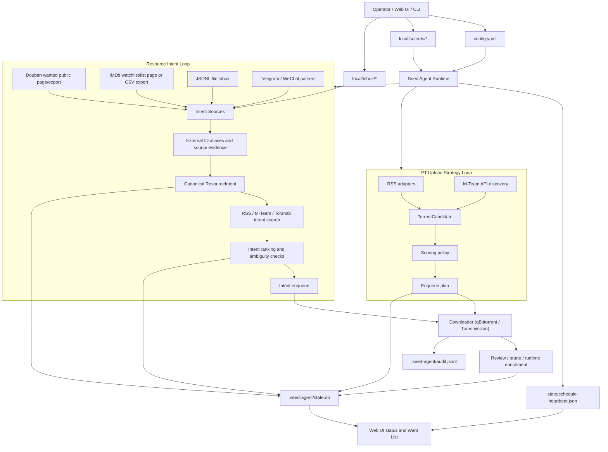

# Architecture And Supported Features

This document is the durable architecture snapshot for the current project shape.
It focuses on shipped or wired behavior, not future aspirations.

## High-Level Architecture

## Runtime Boundaries

- `config.yaml` stores strategy and integration configuration.
- `local/secrets/*` stores credentials such as qBittorrent credentials, M-Team
  API keys, cookies, and chat bridge secrets. Secret values are not written to
  normal config or Web UI payloads.
- `.seed-agent/state.db` is durable local evidence for candidates, intents,
  release candidates, qB runtime facts, and lifecycle reconciliation.
- `.seed-agent/audit.jsonl` records downloader mutations and policy decisions.
- `state/schedule-heartbeat.json` is the scheduler liveness signal.
- Web UI runtime provenance exposes the active config path, state path, and
  heartbeat path so operators can tell whether they are inspecting the expected
  Docker/CLI/Unraid runtime files.

## Supported Features

| Area | Current support |
| --- | --- |
| Deployment | Docker image, Docker Compose, Unraid DockerMan template, Kubernetes CronJob example, scheduler heartbeat, runtime status, healthcheck, optional Web UI sidecar process in the scheduler container. |
| Downloader | qBittorrent reference adapter plus Transmission RPC adapter. Category policies define mutable seed pools and add-only media pools. |
| PT discovery | NexusPHP-style RSS, M-Team RSS fallback, M-Team API discovery with native filters and deferred download-token resolution. |
| Seed strategy | Free/2x-free filtering, leecher/seeder scoring, size scoring, runtime enqueue gates, budget-pool and free-disk pause behavior, review, prune, stale-state reconciliation. |
| Strategy reporting | `strategy-report`, joined enqueue-time evidence, qB runtime enrichment, no-upload observation, missing-from-qB reconciliation. |
| Resource intents | CLI add, JSONL inbox, Douban wanted ingestion, IMDb watchlist/list ingestion, Letterboxd CSV ingestion, Telegram polling, deterministic parsing, RSS/M-Team/Torznab search, ranking, rejection, explicit candidate enqueue. |
| Want List | Web UI page backed by canonical intent state, Douban/IMDb source labels, source/type filters, merged source evidence, media type, added time, search/queue status, and candidate review. |
| M-Team intent search | Native Douban/IMDb ID search first, title/year fallback search, generic `quality_tag_scores` after fetch, captured M-Team tags, and configurable TV/anime `series_search_mode` for season-pack or episode search. |
| Torznab intent search | First non-M-Team provider used to validate the `SearchProvider` contract and release candidate persistence. |
| Web UI | Local settings UI, tracker config, read-only status, budget-pool summary, safe section saves with schema validation and diff preview, search/acquisition settings, Douban/IMDb Want List source configuration, runtime provenance, preview-first Want List refresh/search, and explicit candidate-level qB enqueue actions. |
| Source adapters | File inbox, Douban wanted, IMDb watchlists, Letterboxd CSV exports, and Telegram polling are wired; the WeChat bridge parser is present but no hosted personal-account receiver loop is shipped. |

## Key Modules

- `src/seed_agent/cli.py`: CLI command surface and runtime assembly.
- `src/seed_agent/config.py`: Pydantic config schema and safe defaults.
- `src/seed_agent/actions/pt.py`: PT discovery, scoring, and M-Team API option assembly.
- `src/seed_agent/actions/intent.py`: intent ingestion, search, ranking, rejection, and enqueue.
- `src/seed_agent/downloaders/base.py`: shared downloader protocol and status capability.
- `src/seed_agent/downloaders/qbittorrent.py`: qBittorrent Web API adapter.
- `src/seed_agent/downloaders/transmission.py`: Transmission RPC adapter.
- `src/seed_agent/sites/mteam.py`: M-Team API/RSS integration and token resolution.
- `src/seed_agent/search/mteam.py`: M-Team intent search provider.
- `src/seed_agent/search/torznab.py`: Torznab search provider.
- `src/seed_agent/sources/douban.py`: Douban wanted ingestion.
- `src/seed_agent/sources/imdb.py`: IMDb watchlist/list ingestion.
- `src/seed_agent/sources/letterboxd.py`: Letterboxd CSV ingestion.
- `src/seed_agent/sources/telegram.py`: Telegram polling ingestion.
- `src/seed_agent/web/app.py`: local Web UI API.
- `src/seed_agent/web/static/*`: local Web UI.
- `src/seed_agent/state.py`: SQLite state model.

## Design Rules

- RSS remains supported even when M-Team API is preferred.
- Secrets stay behind gitignored local files and are referenced by path.
- Downloader mutations are dry-run by default unless the operator explicitly executes.
- Web UI status, config preview, tracker probe, and Want List search surfaces may
  read runtime/downloader state or external sources, but they must not enqueue
  to qBittorrent or clean up torrents.
- Web UI downloader enqueue is limited to an explicit reviewed Want List candidate
  action. Batch execution, scheduler changes, and cleanup remain CLI-first
  operator workflows.
- Cleanup authority comes from configured category policy, not tags alone.
- Source adapters stay upstream of the generic `ResourceIntent` boundary.
- Want List deduplication uses reliable external ID aliases only; title-only
  fuzzy matching must not auto-merge works.
- Release-quality preferences are composable tag-group score knobs, not hardcoded profiles.

Operator workflow details live in
[`docs/operations/web-ui-operator-guide.md`](operations/web-ui-operator-guide.md).
